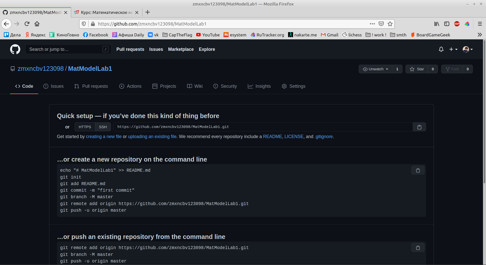
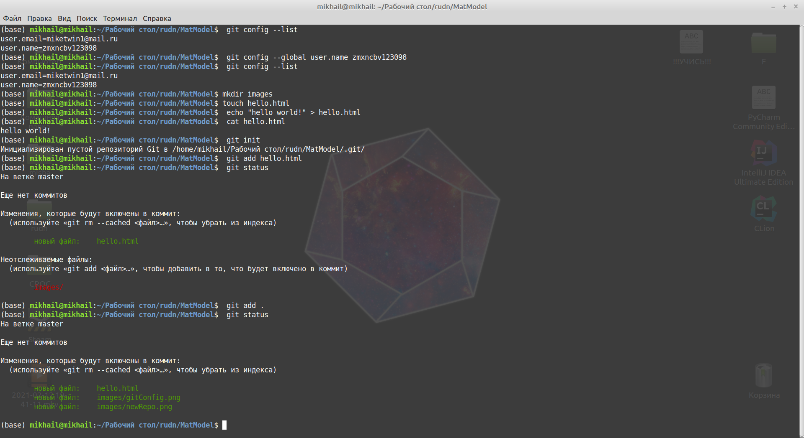
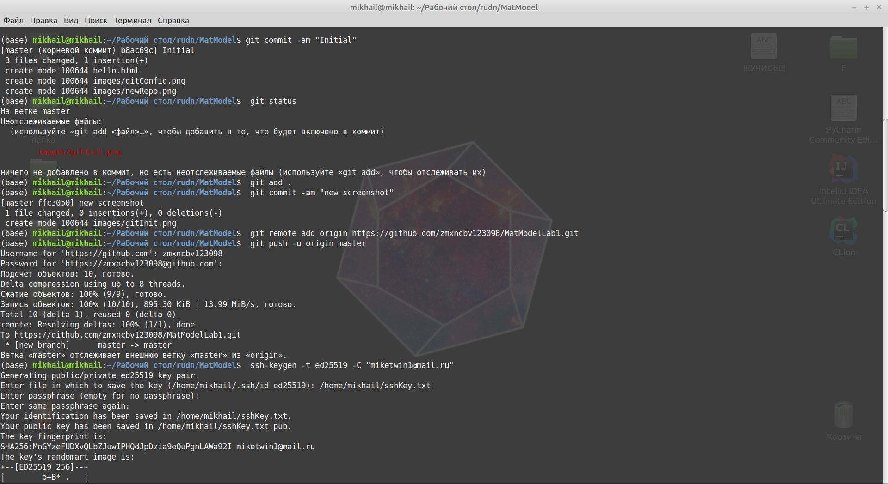
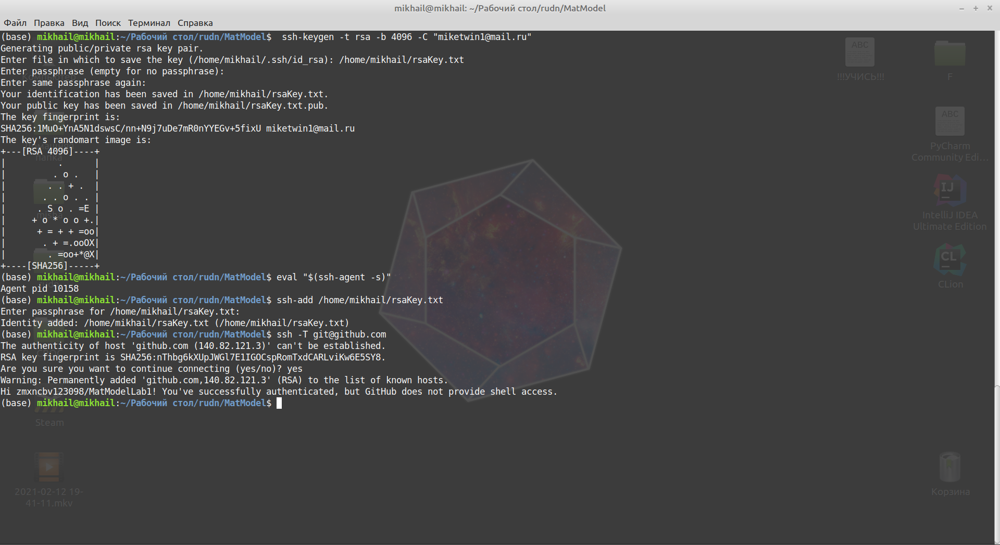
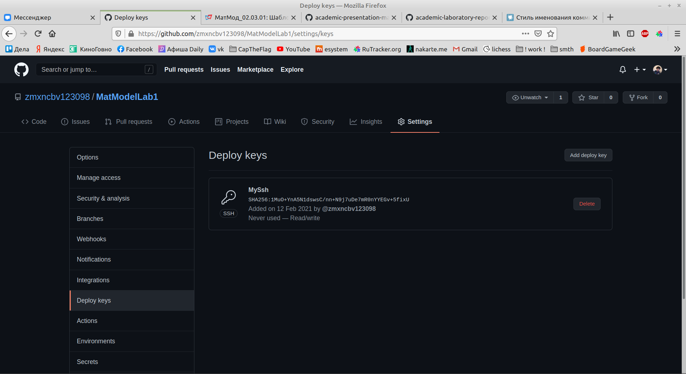
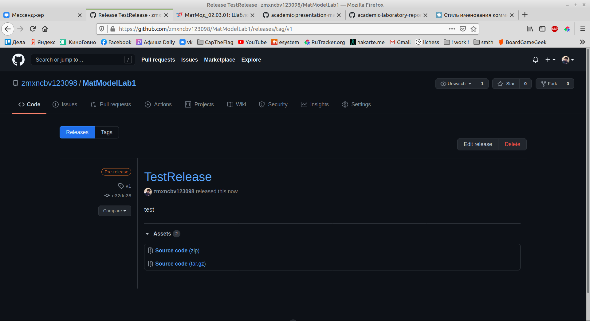

# Отчет по Лабораторной №1

---
# Front matter
lang: ru-RU
title: "Лабораторная работа 1"
subtitle: "git и markdown"
author: "Бешкуров Михаил Борисович"

# Formatting
toc-title: "Содержание"
toc: true # Table of contents
toc_depth: 2
fontsize: 12pt
linestretch: 1.5
papersize: a4paper
documentclass: scrreprt
polyglossia-lang: russian
polyglossia-otherlangs: english
mainfont: PT Serif
romanfont: PT Serif
sansfont: PT Sans
monofont: PT Mono
mainfontoptions: Ligatures=TeX
romanfontoptions: Ligatures=TeX
sansfontoptions: Ligatures=TeX,Scale=MatchLowercase
monofontoptions: Scale=MatchLowercase
indent: true
pdf-engine: lualatex
header-includes:
  - \linepenalty=10 # the penalty added to the badness of each line within a paragraph (no associated penalty node) Increasing the value makes tex try to have fewer lines in the paragraph.
  - \interlinepenalty=0 # value of the penalty (node) added after each line of a paragraph.
  - \hyphenpenalty=50 # the penalty for line breaking at an automatically inserted hyphen
  - \exhyphenpenalty=50 # the penalty for line breaking at an explicit hyphen
  - \binoppenalty=700 # the penalty for breaking a line at a binary operator
  - \relpenalty=500 # the penalty for breaking a line at a relation
  - \clubpenalty=150 # extra penalty for breaking after first line of a paragraph
  - \widowpenalty=150 # extra penalty for breaking before last line of a paragraph
  - \displaywidowpenalty=50 # extra penalty for breaking before last line before a display math
  - \brokenpenalty=100 # extra penalty for page breaking after a hyphenated line
  - \predisplaypenalty=10000 # penalty for breaking before a display
  - \postdisplaypenalty=0 # penalty for breaking after a display
  - \floatingpenalty = 20000 # penalty for splitting an insertion (can only be split footnote in standard LaTeX)
  - \raggedbottom # or \flushbottom
  - \usepackage{float} # keep figures where there are in the text
  - \floatplacement{figure}{H} # keep figures where there are in the text
---

# Цель работы

Освоить работу с программой контроля версий GIT и научиться пользоваться облегчённым языком разметки. 

# Задание

1. Создать репозиторий.
2. Создать и загрузить файлы на github.
3. Сделать коммит и пуш на github.
4. Подключить SSH ключ к репозиторию.
5. Сделать релиз.
6. Оформить отчет и презентацию в форматах pdf и markdown.

# Выполнение лабораторной работы

Создал репозиторий на github (рис. 1)

{рис. 1}

Создал папку с проектом, проверил конфигурацию git, инициальзировал репозиторий и добавил все существующие файлы на данный момент (рис. 2)

{рис. 2}

Произвёл коммит и загрузил все файлы на сервер github (рис. 3)

{рис. 3}

Подключил SSH ключ к репозиторию. (рис. 4-5)

{рис. 4}
{рис. 5}

Сделал релиз (рис. 6)

{рис. 6}

# Выводы

Освоил основные принципы работы с github и marldown. 

### License

Бешкуров Михаил Борисович НКНбд-01-18 

