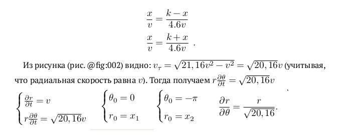
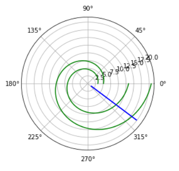

---
## Front matter
lang: ru-RU
title: Лабораторная № 2
author: |
	Бешкуров Михаил Борисович, НКНбд-01-18

## Formatting
toc: false
slide_level: 2
theme: metropolis
header-includes: 
 - \metroset{progressbar=frametitle,sectionpage=progressbar,numbering=fraction}
 - '\makeatletter'
 - '\beamer@ignorenonframefalse'
 - '\makeatother'
aspectratio: 43
section-titles: true
---

# Цель работы

- Научиться решать задачу о погоне;
- Строить графики траектории движения;
- Выводить уравнение, описывающее движение.

# Задачи

1. Записать уравнение, описывающее движение катера, с начальными условиями для двух случаев (в зависимости от расположения катера относительно лодки в начальный момент времени).
2. Постройте траекторию движения катера и лодки для двух случаев.
3. Найдите точку пересечения траектории катера и лодки 

# Результаты выполнения лабораторной работы

## Уравнение

{ #fig:001 width=70% }

## Результаты выполнения лабораторной работы

{ #fig:002 width=70% }

##

Спасибо за внимание!

