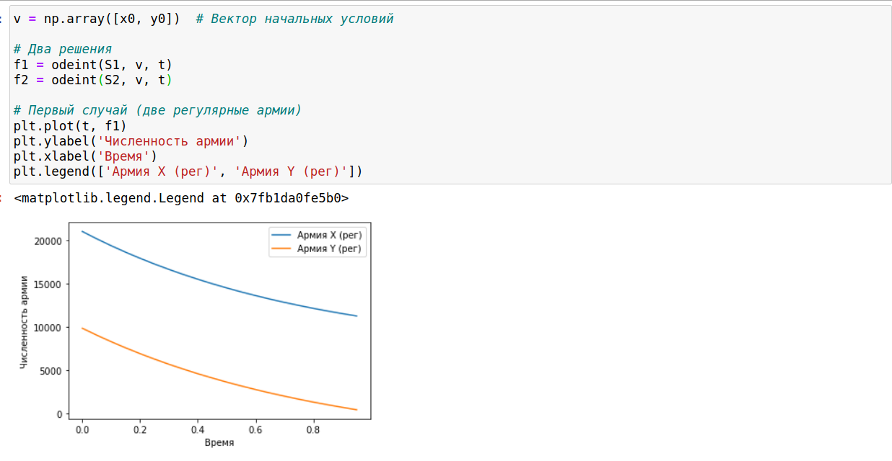
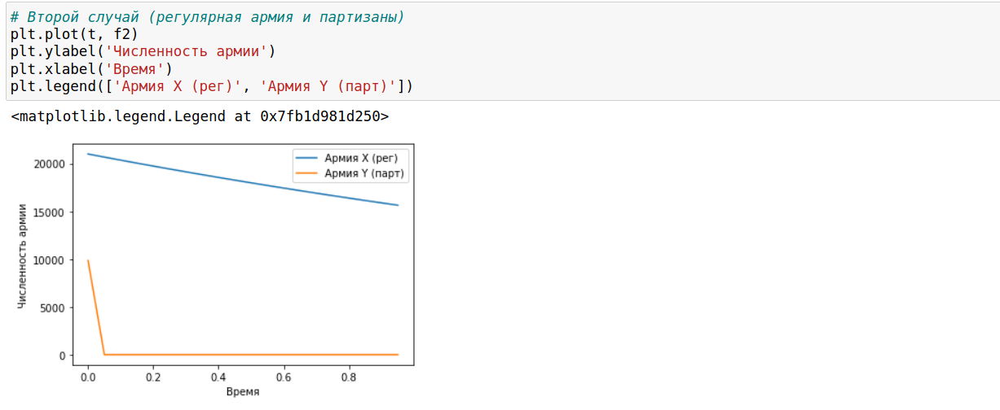

---
## Front matter
lang: ru-RU
title: Лабораторная № 3
author: |
	Бешкуров Михаил Борисович, НКНбд-01-18

## Formatting
toc: false
slide_level: 2
theme: metropolis
header-includes: 
 - \metroset{progressbar=frametitle,sectionpage=progressbar,numbering=fraction}
 - '\makeatletter'
 - '\beamer@ignorenonframefalse'
 - '\makeatother'
aspectratio: 43
section-titles: true
---

# Цель работы

- Рассмотреть простейшую модель боевых действий – модель Ланчестера:
	- просчитывать возможности подходов подкреплений к армиям;
	- составлять системы дифференциальных уравнений изменения численностей армий;
	- строить графики для моделей боевых действий. 

# Задачи

- Построить графики изменения численности армии для двух случаев:
	- военные действия между двумя регулярными войсками;
	- военные действия между регулярным войском и партзанами. 

# Результаты выполнения лабораторной работы

## Результаты выполнения лабораторной работы

{ #fig:002 width=70% }

## Результаты выполнения лабораторной работы

{ #fig:003 width=70% }

## {.standout}
Спасибо за внимание!

