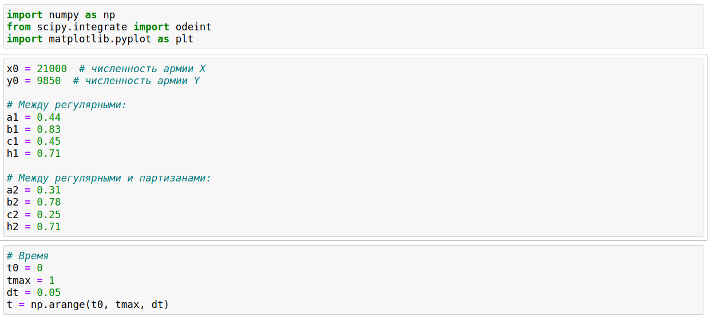
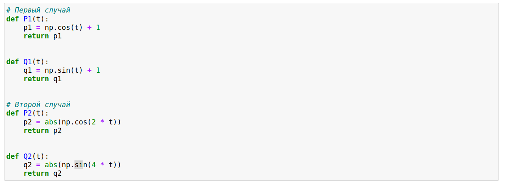
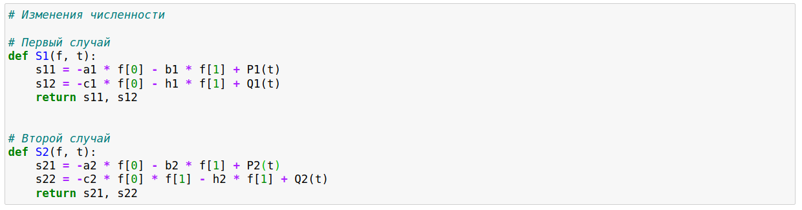
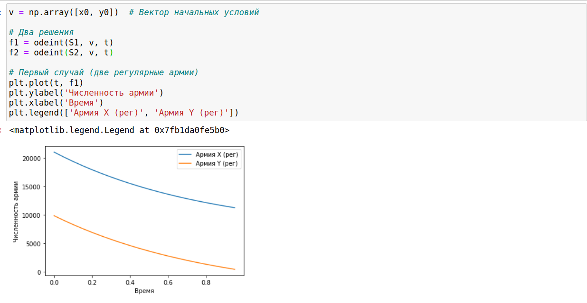
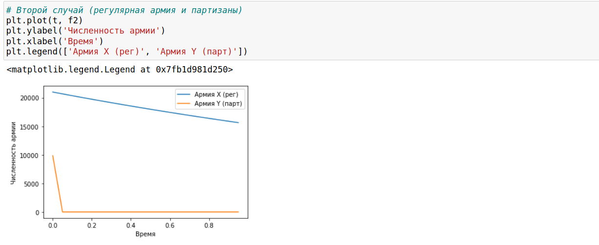

---
# Front matter
lang: ru-RU
title: "Лабораторная работа 3"
subtitle: "Модель боевых действий"
author: "Бешкуров Михаил Борисович"

# Formatting
toc-title: "Содержание"
toc: true # Table of contents
toc_depth: 2
fontsize: 12pt
linestretch: 1.5
papersize: a4paper
documentclass: scrreprt
polyglossia-lang: russian
polyglossia-otherlangs: english
mainfont: PT Serif
romanfont: PT Serif
sansfont: PT Sans
monofont: PT Mono
mainfontoptions: Ligatures=TeX
romanfontoptions: Ligatures=TeX
sansfontoptions: Ligatures=TeX,Scale=MatchLowercase
monofontoptions: Scale=MatchLowercase
indent: true
pdf-engine: lualatex
header-includes:
  - \linepenalty=10 # the penalty added to the badness of each line within a paragraph (no associated penalty node) Increasing the value makes tex try to have fewer lines in the paragraph.
  - \interlinepenalty=0 # value of the penalty (node) added after each line of a paragraph.
  - \hyphenpenalty=50 # the penalty for line breaking at an automatically inserted hyphen
  - \exhyphenpenalty=50 # the penalty for line breaking at an explicit hyphen
  - \binoppenalty=700 # the penalty for breaking a line at a binary operator
  - \relpenalty=500 # the penalty for breaking a line at a relation
  - \clubpenalty=150 # extra penalty for breaking after first line of a paragraph
  - \widowpenalty=150 # extra penalty for breaking before last line of a paragraph
  - \displaywidowpenalty=50 # extra penalty for breaking before last line before a display math
  - \brokenpenalty=100 # extra penalty for page breaking after a hyphenated line
  - \predisplaypenalty=10000 # penalty for breaking before a display
  - \postdisplaypenalty=0 # penalty for breaking after a display
  - \floatingpenalty = 20000 # penalty for splitting an insertion (can only be split footnote in standard LaTeX)
  - \raggedbottom # or \flushbottom
  - \usepackage{float} # keep figures where there are in the text
  - \floatplacement{figure}{H} # keep figures where there are in the text
---

# Цель работы

- Рассмотреть простейшую модель боевых действий – модель Ланчестера:
	- Просчитывать возможности подходов подкреплений к армиям;
	- Составлять системы дифференциальных уравнений изменения численностей армий;
	- Строить графики для моделей боевых действий. 

# Задание

Между страной Х и страной У идет война. Численность состава войск исчисляется от начала войны, и являются временными функциями
$x(t)$ и $y(t)$. В начальный момент времени страна Х имеет армию численностью 21 000 человек, а в распоряжении страны У армия численностью в 9 850 человек. Для упрощения модели считаем, что коэффициенты $a,b,c,h$ постоянны. Также считаем $P(t)$ и $Q(t)$ непрерывные функции.

Постройте графики изменения численности войск армии Х и армии У для следующих случаев:

Между регулярными войсками:

$$ \frac{\partial x}{\partial t} = -0.44x(t) - 0.83y(t) + cos(t) + 1$$
$$ \frac{\partial y}{\partial t} = -0.45x(t) - 0.71y(t) + sin(t) + 1$$

Между регулярными и партизанами:

$$ \frac{\partial x}{\partial t} = -0.31x(t) - 0.78y(t) + |cos(2t)|$$
$$ \frac{\partial y}{\partial t} = -0.25x(t)y(t) - 0.71y(t) + |sin(4t)|$$

# Выполнение лабораторной работы

Код на python:

Коэффициенты (рис. -@fig:001)

{ #fig:001 width=70% }

Функции 1 (рис. -@fig:002)

{ #fig:001 width=70% }

Функции 2 (рис. -@fig:003)

{ #fig:001 width=70% }

График первого случая (рис. -@fig:004)

{ #fig:001 width=70% }

График второго случай (рис. -@fig:005)

{ #fig:002 width=70% }

# Выводы

 - Рассмотрел простейшую модель боевых действий – модель Ланчестера:
	- Научился просчитывать возможности подходов подкреплений к армиям;
	- Научился оставлять системы дифференциальных уравнений изменения численностей армий;
	- Научился строить графики для моделей боевых действий. 
