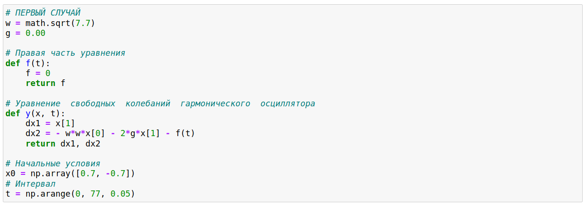
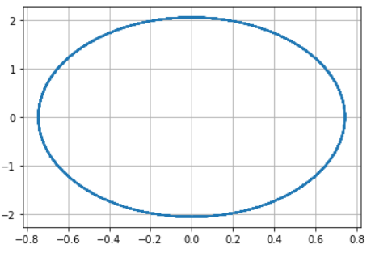
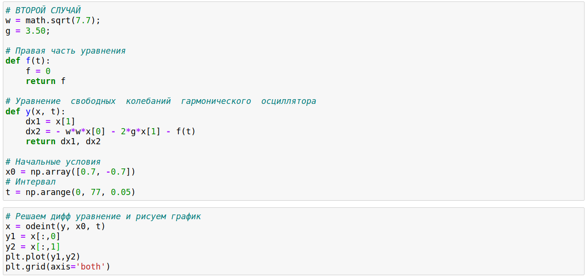
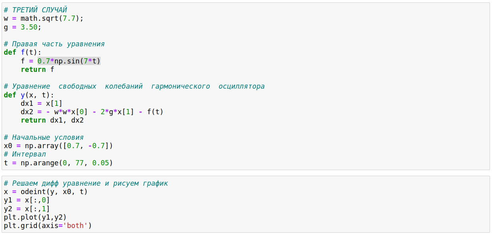
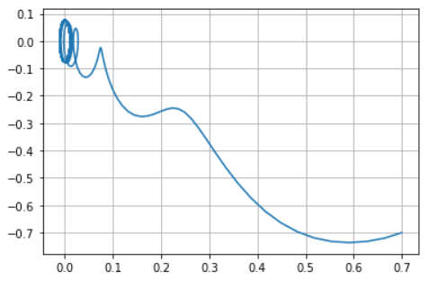

---
# Front matter
lang: ru-RU
title: "Лабораторная работа 4"
subtitle: "Модель гармонических колебаний"
author: "Бешкуров Михаил Борисович"

# Formatting
toc-title: "Содержание"
toc: true # Table of contents
toc_depth: 2
fontsize: 12pt
linestretch: 1.5
papersize: a4paper
documentclass: scrreprt
polyglossia-lang: russian
polyglossia-otherlangs: english
mainfont: PT Serif
romanfont: PT Serif
sansfont: PT Sans
monofont: PT Mono
mainfontoptions: Ligatures=TeX
romanfontoptions: Ligatures=TeX
sansfontoptions: Ligatures=TeX,Scale=MatchLowercase
monofontoptions: Scale=MatchLowercase
indent: true
pdf-engine: lualatex
header-includes:
  - \linepenalty=10 # the penalty added to the badness of each line within a paragraph (no associated penalty node) Increasing the value makes tex try to have fewer lines in the paragraph.
  - \interlinepenalty=0 # value of the penalty (node) added after each line of a paragraph.
  - \hyphenpenalty=50 # the penalty for line breaking at an automatically inserted hyphen
  - \exhyphenpenalty=50 # the penalty for line breaking at an explicit hyphen
  - \binoppenalty=700 # the penalty for breaking a line at a binary operator
  - \relpenalty=500 # the penalty for breaking a line at a relation
  - \clubpenalty=150 # extra penalty for breaking after first line of a paragraph
  - \widowpenalty=150 # extra penalty for breaking before last line of a paragraph
  - \displaywidowpenalty=50 # extra penalty for breaking before last line before a display math
  - \brokenpenalty=100 # extra penalty for page breaking after a hyphenated line
  - \predisplaypenalty=10000 # penalty for breaking before a display
  - \postdisplaypenalty=0 # penalty for breaking after a display
  - \floatingpenalty = 20000 # penalty for splitting an insertion (can only be split footnote in standard LaTeX)
  - \raggedbottom # or \flushbottom
  - \usepackage{float} # keep figures where there are in the text
  - \floatplacement{figure}{H} # keep figures where there are in the text
---

# Цель работы

Ознакомление с моделью линейного гармонического осциллятора  и ее построение с помощью языка программирования Python. 

# Задание

1. Построить фазовый портрет гармонического осциллятора и решенить уравнения гармонического осциллятора без затуханий и без действий внешней силы.
2. Построить фазовый портрет гармонического осциллятора и решенить уравнения гармонического осциллятора с затуханием и без действий внешней силы.
3. Построить фазовый портрет гармонического осциллятора и решенить уравнения гармонического осциллятора с затуханием и под действием внешней силы.

# Выполнение лабораторной работы

Уравнение свободных колебаний гармонического осциллятора имеет следующий вид:
$$ \ddot {x} + 2 \gamma \dot {x} + w_0^2x = f(t) $$
$x$ — переменная, описывающая состояние системы (смещение грузика, заряд конденсатора и т.д.)
$t$ — время
$w$ — частота
$\gamma$ — затухание 
Интервал: $t \in [0; 77]$ (шаг 0.05). 
Начальные условия: $x_0 = 0.7, y_0 = -0.7$ 

1. Уравнение гармонического осциллятора без затухания и без действия внешней силы: 
$$ \ddot {x} + 7.7x = f(t) $$
где 
$w = \sqrt{7.7}$ 
$\gamma = 0.0$ 
$f(t) = 0.0$ 
Ниже представлен код программы для первого случая, выполненный на языке программирования Python. (рис 1. -@fig:001) 

{ #fig:001 width=70% } 

Также ниже представле график для первого случая. (рис 2. -@fig:001) 

{ #fig:001 width=70% } 

2. Уравнение гармонического осциллятора с затуханием и без действия внешней силы: 
$$ \ddot {x} + 7 \dot {x} + 7.7x = 0 $$
где 
$w = \sqrt{7.7}$ 
$\gamma = 3.5$ 
$f(t) = 0.0$ 
Ниже представлен код программы для второго случая, выполненный на языке программирования Python. (рис 3. -@fig:001) 

{ #fig:001 width=70% } 

Также ниже представле график для второго случая. (рис 4. -@fig:001) 

{ #fig:001 width=70% } 

3. Уравнение гармонического осциллятора с затуханием и под действием внешней силы: 
$$ \ddot {x} + 7 \dot {x} + 7.7x = 0.7sin(7t) $$
где 
$w = \sqrt{7.7}$ 
$\gamma = 3.5$ 
$f(t) = 0.7sin(7t)$ 
Ниже представлен код программы для третьего случая, выполненный на языке программирования Python. (рис 5. -@fig:001) 

{ #fig:001 width=70% } 

Также ниже представле график для третьего случая. (рис 6. -@fig:001) 

{ #fig:001 width=70% } 

# Ответы на вопросы:
1. Запишите простейшую модель гармонических колебаний 
Простейшая модель гармонических колебаний имеет следующий вид:
$$ x = x_m cos(\omega t + \phi_0) $$
2. Дайте определение осциллятора 

Осциллятор - система, совершающая колебания, показатели которой периодически повторяются во времени. 
3. Запишите модель математического маятника 
$$\frac{\partial^2 \alpha}{\partial t^2} + \frac{\gamma}{L} sin{\alpha} = 0$$
4. Запишите алгоритм перехода от дифференциального уравнения второго порядка к двум дифференциальным уравнениям первого порядка 

Пусть у нас есть дифференциальное уравнение 2-го порядка:
$$ \ddot{x} + w_0^2x = f(t) $$
Для перехода к системе уравнений первого порядка сделаем замену (это метод Ранге-Кутты): 
$$ y = \dot{x} $$
Тогда получим систему уравнений:
	$$ 
                \begin{cases}
                    y = \dot{x}
                    \\
                    \dot{y} = - w_0^2x
                 \end{cases}
        $$
5. Что такое фазовый портрет и фазовая траектория?

Фазовый портрет — это то, как величины, описывающие состояние системы, зависят друг от друга.

Фазовая траектория — кривая в фазовом пространстве, составленная из точек, представляющих состояние динамической системы в последовательные моменты времени в течение всего времени эволюции.  

# Выводы

Ознакомился с моделью линейного гармонического осциллятора, решив уравнения гармонического осциллятора и построив его фазовые портреты.
